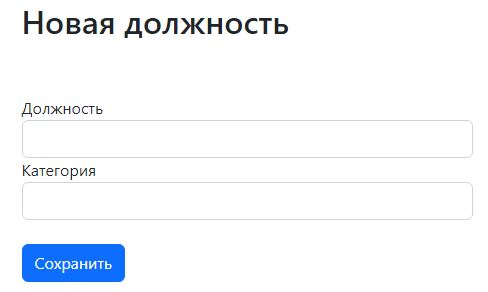
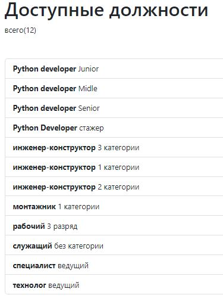
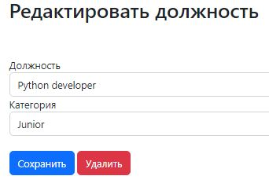
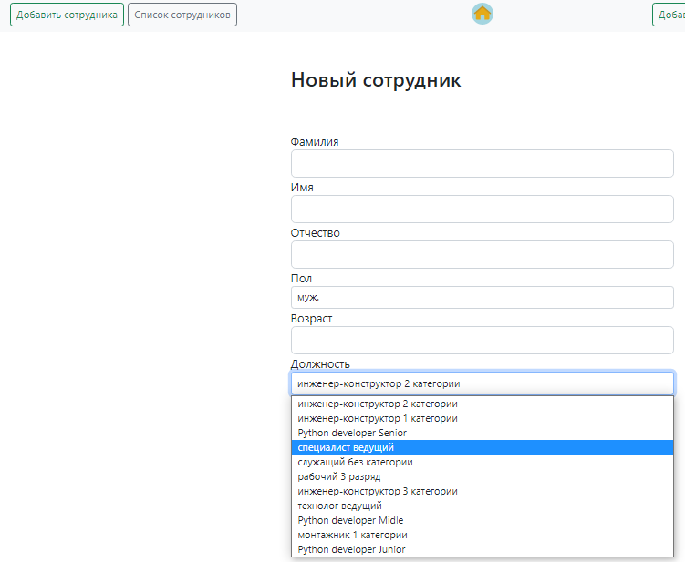
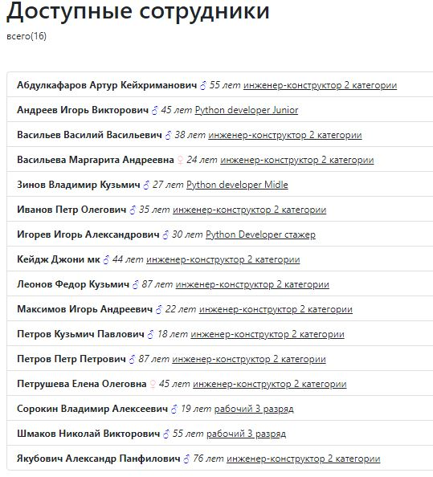
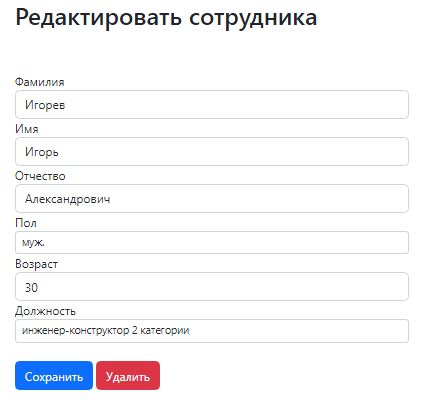
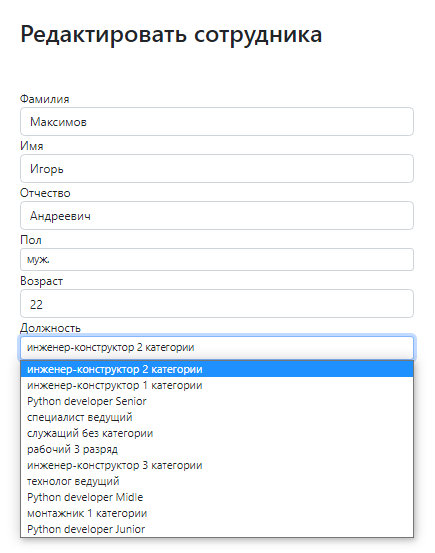
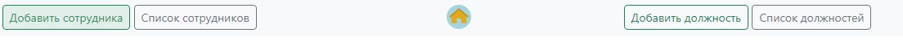

# Тестовое задание
### Разработка веб сервиса, который:
### Задание №1 — Позволяет создавать, редактировать, просматривать список должностей
#### Решение:
В качестве веб фреймворка используется Django 4.0.5. Для создания фронтэнда части сервиса использовались: HTML и Bootstrap v5.2.
Изначально была создана по умолчанию в Django БД "db.sqlite3". Затем выполнена миграция БД на движке "postgresql_psycopg2" на хостинг heroku.com.
#### Окно добавления новой должности


#### Окно просмотра доступных должностей
(по умолчанию выполнена сортировка по названию должности)


#### Окно редактирования выбранной должности


### Задание №2 — Позволяет создавать, редактировать, просматривать сотрудников. При создании, редактировании сотрудника предусмотреть возможность выбора должности из ранее созданных должностей.
#### Решение:

#### Окно добавления нового сотрудника:


#### Окно просмотра доступных сотрудников:
(по умолчанию выполнена сортировка по фамилии сотрудников)


#### Окно редактирования выбранного сотрудника


#### При создании, редактировании сотрудника предусмотреть возможность выбора должности из ранее созданных должностей.


#### Доступная навигация в веб сервисе


Сервис упакован в Docker. Для запуска достаточно находиться в директории с файлом _'manage.py'_ и в терминале ввести следующее:
```shell
    docker-compose build
    docker-compose up
```

Доступ к веб сервису:
```shell
    http://127.0.0.1:8000/ - в браузере
```